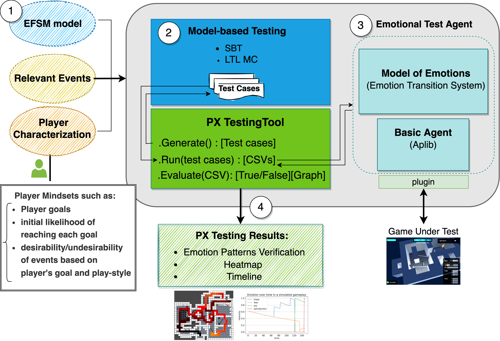

# PX-MBT

**PX-MBT** is a framework for automated player experience testing with emotion pattern verification.
* PX-MBT utilizes a model-based testing approach for test suite generation
* It employs a computational model of emotions developed based on a psychological theory of emotions to model players' emotions during game-plays (more specifically, Ortony, Clore, and Collins' theory/OCC). More on the computational model used by PX-MBT can be found: [in this paper](https://link-springer-com.proxy.library.uu.nl/chapter/10.1007/978-3-030-97457-2_9).
* It verifies emotion patterns given by game designers.

#### Architecture

The picture below shows the general architecture of PX-MBT. There are four main components:
the **Model-based Testing** component for generating tests using [EvoMBT](https://github.com/iv4xr-project/iv4xr-mbt),  the **Model of Emotions** component implements the [computational model of emotions](https://github.com/iv4xr-project/jocc),
an  [aplib](https://github.com/iv4xr-project/aplib)
**basic test agent** for controlling the in-game player-character, and a set of APIs and scripts labelled as the **PX Testing Tool** as an interface for a game designer towards the framework.

PX-MBT requires some inputs that the game designers/developers need to provide inputs; these are ① in the picture.

| px-mbt architecture |
|---|
|  |

PX-MBT offers the following main functionalities:

   * **Model-based test suite generation.** Given a model (in extended finite state machine/EFSM), the _Model-based testing_ component ②  generates a test suite consisting of abstract test cases to be executed on the game under test (GUT). It employs _EvoMBT_ and _Aplib_ which together offer the possibility of using various search algorithms (e.g. MOSA) and LTL model checking for generating test cases from a model.

   * **Agent-based execution**. To execute an abstract test case that comes from a model, it needs to be interpreted to concrete interactions with the GUT. This step is also called _concretization_. PX-MBT uses _aplib_ agents as the executor: the test case is first coverted to goals and tactics for an agent, which in turn converts tactics into primitive interactions with the GUT.
   Aplib is an agent programming framework specifically for testing computer games, e.g. it comes with a programming model which is suitable for that purpose. Using aplib eases the effort in implementing the concretization layer.

   * **Emotion trace generation.** Attaching the Model of Emotions component to  an aplib basic test agent creates an _emotional test agent_ ③, which is able to simulate emotions based on incoming events. Via a 'plugin' (also called `Environment`) the emotional test agent is connected to the GUT. Each (abstract) test case of the test suite is then given to the agent for execution. The agent computes its emotional state upon observing events and records it in a _trace_ file.

   * **Emotion pattern verification.** After a whole test suite is executed on the GUT, functions from the PX Testing Tool can be used to analyze the produced emotion traces, e.g. to verify emotional requirements and to make heat-maps and  timeline graphs of the dynamic of the emotions that occur during the tests.

   * **Data Export.** The framework exports a range of artifacts. Test cases are exported in various forms: as text, graphically through dot syntax, in serialized binary format, and in custom CSV formats. Emotion trace files are exported in CSV format, while heat-maps and timeline graphs are saved in PNG format.

#### How to build

PX-MBT is written in Java. It requires Java-11 or higher. The project is Maven-based.

   * To build just do `mvn compile` from the project's root. This will automatically download all its dependencies and then compile the project.
   * If you want to install the project into your local Maven repository, do `mvn install -DskipTests` (skip the tests, as some of them are actually experiments rather than pure-tests).

#### Examples

  * [A quick example (MiniDungeon)](./docs/MD_L5.md)
  * [A simple example with Lab Recruits](.docs/LR_3rooms.md)

#### Documentation

   * [Modelling a game with an EFSM, and model-based testing.](./docs/efsm.md)
   * [Building the 'plugin' to connect PX-MBT to your own computer game](./docs/plugin.md).
   * [Concretization layer](./docs/concretization.md)
   * [Preparing PX testing](./docs/preppx.md)
   * [Running the test cases (and producing emotion traces)](./docs/running.md)
   * [PX verification and other analyses](./docs/analyses.md)

#### FASE-23 Study

This is a study conducted to assess the feasibility and performance of PX-MBT approach an a 3D game called [Lab Recruits](https://github.com/iv4xr-project/labrecruits). The artifact of this study is available, containing its dataset and a replication package:

   * [PX-MBT FASE-23 experiment replication-package and dataset](https://zenodo.org/records/7506758). A copy of the  dataset is provided in this project as well, in `./FASE23Dataset`.
   * [Instructions](./FASE23Dataset/FASE23-README.md)
   * [The paper describing the experiments: _Model-based Player Experience Testing with Emotion Pattern Verification_](https://link-springer-com.proxy.library.uu.nl/chapter/10.1007/978-3-031-30826-0_9)

#### Papers

* Saba Gholizadeh Ansari, I. S. W. B. Prasetya, Davide Prandi, Fitsum Meshesha Kifetew, Frank Dignum, Mehdi Dastani, Gabriele Keller, [_Model-based Player Experience Testing with Emotion Pattern Verification_](https://link-springer-com.proxy.library.uu.nl/chapter/10.1007/978-3-031-30826-0_9), in the 26th International Conference on Fundamental Approaches to Software Engineering (FASE), 2023.

* [_An Appraisal Transition System for Event-Driven Emotions in Agent-Based Player Experience Testing_](https://link.springer.com/chapter/10.1007/978-3-030-97457-2_9), Ansari, Prasetya, Dastani, Dignum, Keller. In
International Workshop on Engineering Multi-Agent Systems (EMAS), 2021.

##### License: Apache 2.0
