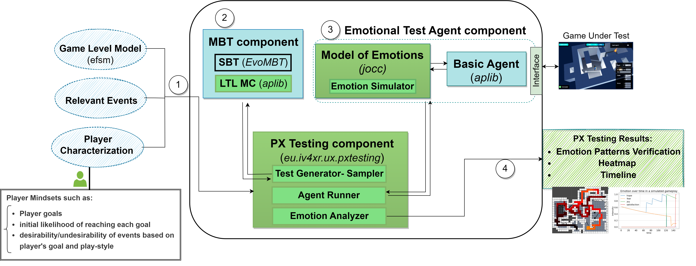

# PX-MBT

**PX-MBT** is a framework for automated player experience testing with emotion pattern verification.
* PX-MBT utilizes a model-based testing approach for test suite generation
* It employs a computational model of emotions developed based on a psychological theory of emotions to model players' emotions during game-plays (more specifically, Ortony, Clore, and Collins' theory/OCC). More on the computational model used by PX-MBT can be found: [in this paper](https://link-springer-com.proxy.library.uu.nl/chapter/10.1007/978-3-030-97457-2_9).
* It verifies emotion patterns given by game designers.

#### Architecture

The picture below shows the general architecture of PX-MBT. There are four main components:
the **Model-based Testing** component for generating tests using [EvoMBT](https://github.com/iv4xr-project/iv4xr-mbt),  the **Model of Emotions** component implements the [computational model of emotions](https://github.com/iv4xr-project/jocc),
an  [aplib](https://github.com/iv4xr-project/aplib)
**basic test agent** for controlling the in-game player-character, and a set of APIs and scripts labelled as the **PX Testing Tool** as an interface for a game designer towards the framework.

PX-MBT requires some inputs that the game designers/developers need to provide inputs; these are ① in the picture.

| px-mbt architecture |
|---|
|  |

PX-MBT offers the following main functionalities:

   * **Model-based test suite generation.** Given a model (in extended finite state machine/EFSM), the _Model-based testing_ component ②  generates a test suite consisting of abstract test cases to be executed on the game under test (GUT). It employs _EvoMBT_ and _Aplib_ which together offer the possibility of using various search algorithms (e.g. MOSA) and LTL model checking for generating test cases from a model.

   * **Agent-based execution**. To execute an abstract test case that comes from a model, it needs to be interpreted to concrete interactions with the GUT. This step is also called _concretization_. PX-MBT uses _aplib_ agents as the executor: the test case is first coverted to goals and tactics for an agent, which in turn converts tactics into primitive interactions with the GUT.
   Aplib is an agent programming framework specifically for testing computer games, e.g. it comes with a programming model which is suitable for that purpose. Using aplib eases the effort in implementing the concretization layer.

   * **Emotion trace generation.** Attaching the Model of Emotions component to  an aplib basic test agent creates an _emotional test agent_ ③, which is able to simulate emotions based on incoming events. Via an 'interface' (also called `Environment`) the emotional test agent is connected to the GUT. Each (abstract) test case of the test suite is then given to the agent for execution. The agent computes its emotional state upon observing events and records it in a _trace_ file.

   * **Emotion pattern verification.** After a whole test suite is executed on the GUT, functions from the PX Testing Tool can be used to analyze the produced emotion traces, e.g. to verify emotional requirements and to make heat-maps and  timeline graphs of the dynamic of the emotions that occur during the tests.

   * **Data Export.** The framework exports a range of artifacts. Test cases are exported in various forms: as text, graphically through dot syntax, in serialized binary format, and in custom CSV formats. Emotion trace files are exported in CSV format, while heat-maps and timeline graphs are saved in PNG format.

#### Examples/demos

Some examples/demos are provided below. To run them you first need to build PX-MBT (see  **How to build** below).

* [A quick example (with a small 2D game MiniDungeon)](./docs/MD_L5.md)
* [A simple example with a game called Lab Recruits](./docs/LR_3rooms.md)

#### How to import PX-MBT into your project

PX-MBT is distributed as a software package. In particular, it is not an end application. The typical use case is to import PX-MBT into your own Java project, which would then give you access to functionalities/APIs of PX-MBT.

As PX-MBT is organized as a **[Maven project](https://maven.apache.org/index.html)**, the expected use case is to import it from another Maven project (or a project that uses a build system that can import a Maven project, such as Gradle).

To import PX-MBT into your Maven project:

1. First, add this [Jitpack repository](https://jitpack.io/) in your `pom.xml`. PX-MBT is distributed from Jitpack. Adding Jitpack repository will make your project to automatically download and install PX-MBT in your own Maven local repository, which is convenient.

   ```xml
    <repositories>
      <repository>
          <id>jitpack.io</id>
          <url>https://jitpack.io</url>
      </repository>
    </repositories>
   ```

1. Add the dependency to PX-MBT in your `pom.xml`, with the right version. In the snippet below the version is 2.0.2.

   ```xml
    <dependency>
        <groupId>com.github.iv4xr-project</groupId>
        <artifactId>eplaytesting-pipeline</artifactId>
        <version>2.0.2</version>
    </dependency>
   ```

The version number must be a git-tag in PX-MBT Github repository.


#### How to build

Building is needed if you want to run the demos, or if you clone PX-MBT to extend it for your own purpose. PX-MBT is written in Java. It requires Java-11 or higher. The project is Maven-based.

   * Clone or download a zip of this project and unzip it. Then, go to the project root.
   * To build just do `mvn compile` from the project's root. This will automatically download all its dependencies and then compile the project.
   * If you want to install the project into your local Maven repository, do `mvn install -DskipTests`.

Some of the packages used by PX-MBT are distributed from jitpack. If some fails to download (e.g. maybe jitpack site is down) you can install it manually. [See the instructions here.](./jitpack_packagges.md)


#### What is system requirement of PX-MBT?

PX-MBT classes and methods would run on any OS (Linux, Windows, Mac, etc) that runs Java-11 or higher. To run PX-MBT demos: the Lab Recruits demo needs either Windows or Mac. The MiniDungeon demo can run on any OS.

The target game (the game on which you want to use PX-MBT for your own project) will have its own system requirement to run, but this is not related to the requirement of PX-MBT itself.

#### What game-architectures can be targeted?

Games written in Java would be easiest to target, as PX-MBT is also written in Java. Other architectures can be targeted through a socket connection. This can be achieved by adding server-side program at the game-side that accepts command from a PX-MBT test agent and translates the command to e.g. player's keyboard command. The server-side program should also able to send back observation on the game state back to the agent. More on this is explained in the **Documentation** section below, on the topic _Building the interface to connect PX-MBT to your own computer game_.


#### Documentation <a name="docs"></a>

The document below explains the general idea of model-based testing of a game, and the main APIs to do it:

   * [Modelling a game with an EFSM, and model-based testing.](./docs/efsm.md)

To use PX-MBT, an 'interface' connecting it to your game under test is needed. The documents below provide guidelines on how to implement such an interface. This would take some effort; but it is a one-off effort, after which you will be able to use the interface for further automated testing the game.

   * [Building the interface to connect PX-MBT to your own computer game](./docs/interface.md).
   * [Concretization layer](./docs/concretization.md)

The documents below explain to generate tests, to run them, and then to perform PX verification on the resulting execution traces.

   * [Preparing PX testing](./docs/preppx.md)
   * [Running the test cases (and producing emotion traces)](./docs/running.md)
   * [PX verification and other analyses](./docs/analyses.md)

#### FASE-23 Study

This is a study conducted to assess the feasibility and performance of PX-MBT approach an a 3D game called [Lab Recruits](https://github.com/iv4xr-project/labrecruits). The artifact of this study is available, containing its dataset and a replication package:

   * [PX-MBT FASE-23 experiment replication-package and dataset](https://zenodo.org/records/7506758). A copy of the  dataset is provided in this project as well, in `./FASE23Dataset`.
   * [Instructions](./FASE23Dataset/FASE23-README.md)
   * [The paper describing the experiments: _Model-based Player Experience Testing with Emotion Pattern Verification_](https://link-springer-com.proxy.library.uu.nl/chapter/10.1007/978-3-031-30826-0_9)

#### Components

PX-MBT makes use of a number of main components. Some of them are provided by other open source projects which are included in PX-MBT as dependencies (this means that you also have access to these projects classes and methods from PX-MBT).

* The _PX Testing Tool_ component: for generating test cases from a model, for reducing the test suite through sampling, for running the test cases on the game under test, and for performing PX evaluation on the generated traces. This component is implemented in PX-MBT.

* The _Model of Emotions_ component is implemented in the project [`jocc`](https://github.com/iv4xr-project/jocc). More information on how this model works can be found in [`jocc site`](https://github.com/iv4xr-project/jocc).

* [_Emotion Pattern_](./docs/analyses.md) is implemented in PX-MBT. It is implemented over LTL (Linear Temporal Logic). The implementation of LTL and LTL model checking in put in the [`aplib`](https://github.com/iv4xr-project/aplib) project, as these are useful for other purposes beyond PX-testing.
`aplib` in included in PX-MBT as dependency.
 [More information about LTL and LTL model checking can be found here](https://github.com/iv4xr-project/aplib/blob/master/docs/manual/LTL.md).

* [_EFSM_](./docs/efsm.md) is provided by the project [`iv4xr-mbt`](https://github.com/iv4xr-project/iv4xr-mbt). It also provides the search-based testing (_SBT_) algorithms used by PX-MBT for its model-based test generation.

* The _Basic Agent_ for executing test cases is providing by the project [`aplib`](https://github.com/iv4xr-project/aplib).


#### Papers

* Saba Gholizadeh Ansari, I. S. W. B. Prasetya, Davide Prandi, Fitsum Meshesha Kifetew, Frank Dignum, Mehdi Dastani, Gabriele Keller, [_Model-based Player Experience Testing with Emotion Pattern Verification_](https://link-springer-com.proxy.library.uu.nl/chapter/10.1007/978-3-031-30826-0_9), in the 26th International Conference on Fundamental Approaches to Software Engineering (FASE), 2023.

* [_An Appraisal Transition System for Event-Driven Emotions in Agent-Based Player Experience Testing_](https://link.springer.com/chapter/10.1007/978-3-030-97457-2_9), Ansari, Prasetya, Dastani, Dignum, Keller. In
International Workshop on Engineering Multi-Agent Systems (EMAS), 2021.

##### License: Apache 2.0
