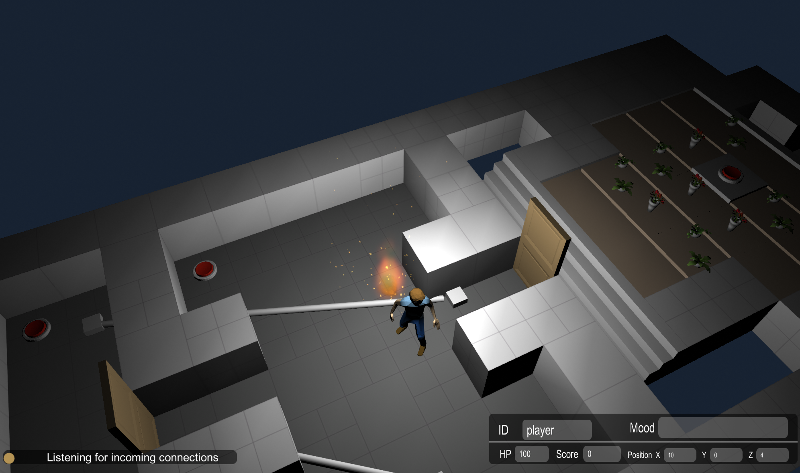
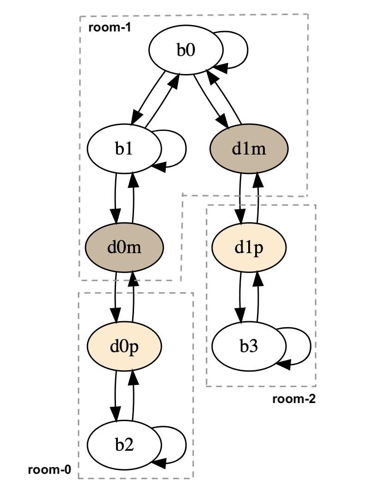

## Demo with Lab Recruits

This demo shows PX-MBT applied on a small level in a game called [Lab Recruits](https://github.com/iv4xr-project/labrecruits). For this demo you need to 'install' the game.

   * Build the game from its source. See the instructions in [the game's site](https://github.com/iv4xr-project/labrecruits).
   * Place the executable in `./labrecruits/gym/`.
      * Windows: put the produced files including LabRecruits.exe in `./labrecruits/gym/Windows/bin/`.
      * Mac: put the produced LabRecruits.app in `./labrecruits/gym/Mac/bin/`.
      * Linux: no Linux version, sorry.

A screenshot of the level is shown below. It consists of three rooms separated by doors. The walls have been removed to give you better sight. The doors are initially closed. The state of a door can be toggled (open/close) by interacting with a button (red). It has to be the right button that is associated with the door. The goal of this level is set as to visit a button at room-2 to the right of the center room (room-1). The button that opens the door to room-2 is located in room-0, on the left of room-1. There are fire flames in the level that can hurt, or even kill the player.

A model of the level is also shown below, showing the doors and buttons in the level.
The model is in the form of a finite state machine (FSM).
Each door is represented by two states, that correspond to the two sides of the doors. Transitions between two different states s1 and s2 represent travel between them. A self transition from s1 to itself represents an interaction with the object that s1 represents (e.g. a button). The model is actually an extended FSM (EFSM), wit two variables _door0_ and _door1_, representing the state of the two doors in the level, but these variables, nor the actual updates to them are not shown in the depiction of the model.

| a three-rooms level | its model |
|---|---|
|  |  |

We will use PX-MBT to create a test suite that will cover all the states in the FSM above. This will create just one test case, that in this case enough to cover all those states. We then immediately run the test case on the game and produce an emotion trace of it.

The demo is setup as a JUnit test-class.
The easiest way to run it is from Maven. But you can also run the correspond class from an IDE, e.g. Eclipse.

```
mvn test -Dtest="eu.iv4xr.ux.pxtesting.labrecruits.Test_LR_MBT_Exec#test_generate_and_exec"
```

The generated emotion trace is put in `./tmp`.

The code of the [invoked test-method is here](./src/test/java/eu/iv4xr/ux/pxtesting/labrecruits/Test_LR_MBT_Exec.java). The major steps are:

   1. `var gen = new TestSuiteGenerator("eu.iv4xr.ux.pxtesting.mbt.EFSMSimple0")` loads the EFSM-model of the level.
   1. `gen.generateWithMC(...)` generates an abstract test suite from the model.
   1. `runner = new PXTestAgentRunner(...)` creates a test-runner. Various parameters are passed to it, including how to connect to the game under test. The runner will create an instance of an emotive agent that will run the test suite and produce emotion traces (in this case, just one trace).
   1. `runner.run_(suite, ...)` This will run the abstract test suite on the game.

#### Verifying PX properties

We can verify PX properties on the produced emotion traces (though in this example, the model only produces one test case, so we will only have one trace).
In PX-MBT we can express a PX property using a pattern. For example the pattern `H;nF;H` specifies an execution/trace where eventually the intensity of the emotion hope rises, and then after some time the we have the second rise in hope, while between the first and the second rises in hope, the intensity of fear never rises. This can be verified using the method  `checkAll`(_pattern_,_separator_,_dir_,_prefix_), where _separator_ is the used separator in the trace-files (comma), _dir_ is the directory where the traces are located, and _prefix_ is a prefix of their names, as a means to filter them.

As a demo you can run this:

```
mvn test -Dtest="eu.iv4xr.ux.pxtesting.labrecruits.Test_LR_MBT_Exec#test_verify_pattern"
```

which performs the following test:

```Java
@Test
public void test_verify_pattern() throws IOException {
		var result = EmotionPattern.checkAll("H;nF;H", ',', "./tmp","tc") ;
		System.out.println(">>> " + result);
		assertTrue(! result.valid() && result.sat()) ;
	}
```

For more documentation about emotion patterns and other means of PX analyses (e.g by producing time graphs), see [here](analyses.md).   

##### Components

If you want to know what were the main components to have PX Testing working on Lab Recruits, you first need to read [the documentations](../README.md#docs), at least up to the section about "running test cases". The section that specifically explains the main components is [here](./preppx.md).

These main components need to be prepared/implemented, before we can have PX testing running. These components are then passed as parameters, in one form or another, to the constructor of `PXTestAgentRunner`. For Lab Recruits, these components are:

   1. A class defining events that matter for PX evaluation: `EventsProducer`. The [source code is here](https://github.com/iv4xr-project/iv4xrDemo/blob/master/src/main/java/agents/EventsProducer.java) (this is borrowed from another project called `iv4xrDemo`).
   1. [A class defining a Player Characterizaiton.](./src/main/java/eu/iv4xr/ux/pxtesting/study/labrecruits/PlayerThreeCharacterization).
   1. A concretization function. [The most essential part of this concretization is here](https://github.com/iv4xr-project/iv4xr-mbt/blob/master/src/main/java/eu/fbk/iv4xr/mbt/concretization/impl/LabRecruitsTestConcretizer.java), which provides a translation from an EFSM abstract test case to an aplib-agent goal structure. This concretization is also borrowed from another project, called `iv4xr-MBT` (aka `EVO-MBT`).
