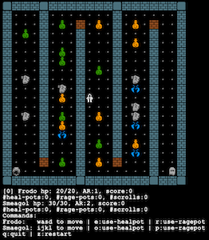
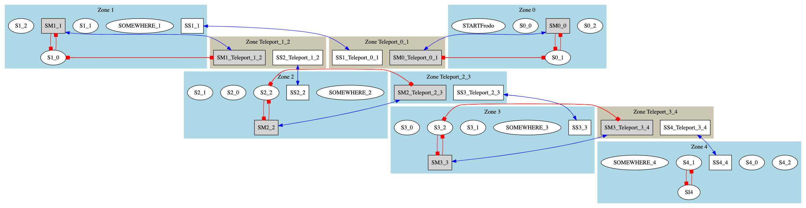

## Quick Example

Run the method `test_generate_and_exec`. This will generate test cases from a model and execute them on a game under test. The generated test cases, and the resulting emotion traces are placen in `./tmp` :

```
mvn test -Dtest="eu.iv4xr.ux.pxtesting.study.minidungeon.Test_MD_MBT_Exec#test_generate_and_exec"
```

## So, what did we just do....?

The game under test is a game called [MiniDungeon](https://github.com/iv4xr-project/MiniDungeon). It is a simple game where the player has to go through a number of mazes to get to the 'final shrine' located in the final maze. To get there, the player has to figure out how to open the access from a maze to the next one. Along the way, of course there will be monsters that will try to hurt the player.

A model of a five-level instance of MiniDungeon is included. A visualization of the model is shown below.

| a maze in MiniDungeon | a model of a 5-mazes level |
|---|---|
|  |   |


The model of each maze is shown in blue. Each maze is connected to the next one through a shrine that acts as a teleport (brown). The shrines are initially closed. Red lines indicate which in-game object need to brought to a shrine to make it open.

#### Generating test cases from a model

You can invoke the method `test1()` using Maven as shown below, from the project's root. It will generate abstract test cases from the model shown above

```
mvn test -Dtest="eu.iv4xr.ux.pxtesting.study.minidungeon.Test_MD_MBT_Gen#test1"
```
The generated test cases are put in `./tmp`:

  * `tc.ser` : a test-case in binary form.
  * `tc.txt` : a text-representation of the test case.
  * `tc.dot` : a DOT-file containing a visualization of the the test case. See [here](https://graphviz.org/) to get a DOT-visualizer app.

Code snippet that call the generator:

```java
var gen = new TestSuiteGenerator("eu.iv4xr.ux.pxtesting.study.minidungeon.EFSM_MD_L5") ;
gen.idFinalState = "SI4" ;
// generate using MOSA:
gen.generateWithSBT(120,null) ;
gen.printStats();
// generate using a model checker (the produced test suite will be added to the one previously generated)
gen.generateWithMC(false, true, false, 80);
gen.printStats();
// apply sampling to select a subset of 20 test cases:
gen.applySampling(8,20);
gen.printStats();
// save the resulting test cases in files:
gen.save("./tmp","tc");
```

Full source code of the method `test1()`: [Test_MD_MBT_Gen](../src/test/java/eu/iv4xr/ux/pxtesting/study/minidungeon/Test_MD_MBT_Gen.java)

#### Executing test cases

The method `test_generate_and_exec()` will generate some test cases from the model, and immediately execute them:

```
mvn test -Dtest="eu.iv4xr.ux.pxtesting.study.minidungeon.Test_MD_MBT_Exec#test_generate_and_exec"
```

Code snippet that call the executor/runner:

```java
EmotiveTestAgent deployTestAgent() {
   // launch an instance of MiniDungeon, then a test agent to it:
   DungeonApp app = deployApp() ;
   var agent = new EmotiveTestAgent("Frodo","Frodo") ;
   agent. attachState(new MyAgentState())
        . attachEnvironment(new MyAgentEnv(app))  ;
   return agent ;
}

run(testsuite) {
   PXTestAgentRunner runner = new PXTestAgentRunner(
      dummy -> deployTestAgent(),
      new MiniDungeonPlayerCharacterization(),
      new MiniDungeonEventsProducer(),
      // test-case concretizer:
      agent -> tc -> MD_FBK_EFSM_Utils.abstractTestSeqToGoalStructure(agent, tc, gwmodel),
      null,
      mentalGoal_cleanseShrine) ;

   runner.run_(testsuite, "./tmp", 8000, 0);  
}
```

Full source code of the method `test_generate_and_exec()`: [Test_MD_MBT_Exec](../src/test/java/eu/iv4xr/ux/pxtesting/study/minidungeon/Test_MD_MBT_Exec.java). You can also check the method `test_load_and_exec()` that loads a previously generated test cases from files and execute them.

#### Emotion traces

In the above runs, the test agent was equipped with an emotion module, so the runs produced emotion traces. Each trace is a sequence of emotion state of the agent, sampled at each update cycle of the agent. The produces traces were put in `./tmp`.

#### Components

If you want to know what were the main components to have PX Testing working on the game MiniDungeon, you first need to read [few other documentations](../README.md#docs), at least up to the section about _"running test cases"_. The section that specifically explains the main components is [here](./preppx.md).

These main components need to be prepared/implemented, before we can have PX testing running. These components are then passed as parameters, in one form or another, to the constructor of `PXTestAgentRunner`. For MiniDungeon, these components are:

   1. A class defining events that matter for PX evaluation: [`MiniDungeonEventsProducer`.](../src/main/java/eu/iv4xr/ux/pxtesting/study/minidungeon/MiniDungeonEventsProducer.java)
   1. [A class defining a Player Characterizaiton.](../src/main/java/eu/iv4xr/ux/pxtesting/study/minidungeon/MiniDungeonPlayerCharacterization.java)
   1. A concretization function. [The most essential part of this concretization is here, in the function `convertToGoalStructure()`](https://github.com/iv4xr-project/aplib/blob/master/src/main/java/nl/uu/cs/aplib/exampleUsages/miniDungeon/testAgent/MiniDungeonModel.java), which provides a translation from an EFSM abstract test case to an aplib-agent goal structure. This concretization is borrowed from the project aplib.
