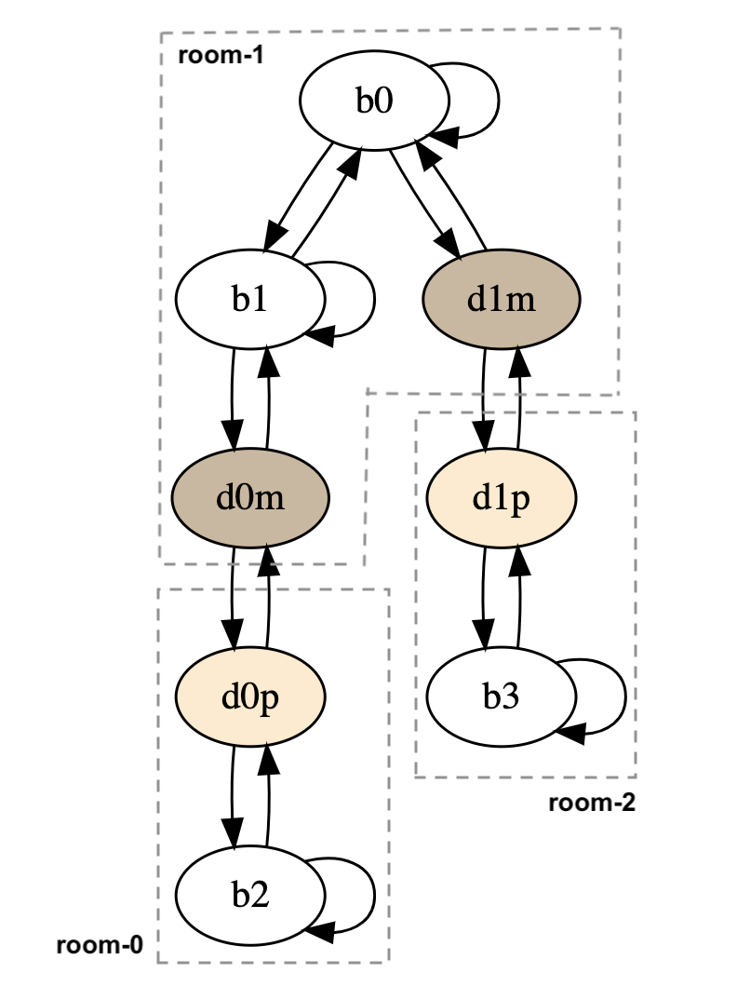

## Modeling a game and model-based testing

We model a game with an _extended finite state machine_ (EFSM). It is a finite state machine, with finite number of states and transitions between them. However, an EFSM also has _variables_. Transitions can be guarded with conditions that refer to the values of these variables, and they can update the values of the variables. As such EFSMs are very expressive. The picture below shows an example of a simple game level in some game. A model of this level is shown next to it.

| a three-rooms level | its model |
|---|---|
|  |  |

The actual game level consists of three rooms with some game objects populating it, such as in-game buttons (red), doors, flames, walls, and floors.
The model captures key objects in the game level: three in-game buttons (b0,b1,b2) and two doors (d1,d2).
In particular, it abstracts away from the level's physical layout.

A self-transition, b0 → b0, represents an interaction with the object.
Transitions between different game-objects represents physical travel (e.g. the transition b0 → b1). So, the model is actually also a navigation graph, as it tells us how to travel from one object to another, e.g. from b2 to b3. It captures navigation at a high level, but keep in mind that the model abstracts away from the level's physical layout, so on its own the model does not know how to avoid physical obstacles like walls. The model also chooses not to include all game objects, e.g. the flames are not included in the model.

Doors are represented by two states, e.g. the door d0 is represented by d0m and d0p, representing the opposite sides of the door. Transitions between them represent a short travel passing through the door; this is of course is only possible if the door is open.

The model shown above is actually just an FSM, and not an **E**FSM. In particular it does not capture the state of the doors (whether they are open or close). To model this, we add variables, e.g. _door0_ and _door1_ (not shown in the picture above) of type Boolean, which are initially false to represent the initial doors' state, which are closed.
The transitions between b0m and b0p is guarded a condition that the variable _door0_ must be true. In the game, the buttons can toggle the state of certain doors. E.g. b2 can open door d1 (or close it again). This is represented by an update associated with the transition b2→b2, to do: _door1 := ¬door1_.

##### Constructing a model

Currently we do not have a graphical tool for constructing a model. However, programmatically constructing a model is supported. See the class [EFSMSimple0](../src/main/java/eu/iv4xr/ux/pxtesting/mbt/EFSMSimple0.java), which shows how we programmatically constructed the EFSM of the above example. A constructed EFSM can be visualized via a DOT visualizer though.

#### Generating test cases from a model

From an EFSM model such as the one above, test cases can be generated. A _test case_ is a sequence of connected transitions between states, starting in the initial state of the EFSM (in the above example, we start at b0). There might be additional requirements, e.g. it should end in a certain state (e.g. it could represent reaching the end state of the game). We can distinguish between positive and negative test cases. A positive test case is a sequence of transitions that should be possible, according to the model. A negative test case is a sequence 𝜎⧺t where 𝜎 is a positive sequence, and t is a transition that should not be possible after 𝜎. A negative test is used to test if the actual system responds appropriately when the user tries something illegal. Since our goal is to do player experience assessment (rather than doing functional testing) we will focus on generating positive test cases.  

Two main algorithms are provided for generating test cases: _search-based algorithm_ and _model checking_. Test cases generated from a model are so-called **abstract** test cases.

##### API

The API for generating test cases from a model is in the class [TestSuiteGenerator](../src/main/java/eu/iv4xr/ux/pxtesting/mbt/TestSuiteGenerator.java). The generator can be configured to aim for state or transition (default) coverage. You can also specify if all test-cases are required to end in a certain state. Main methods:

  * `generateWithSBT()`: generate a test suite using a search-based algorithm.

  In the field `sbtAlgorithm` (of the class `TestSuiteGenerator`) you can specify which SB algorithm to use, there are a number of implementations provided (thanks to EVO-MBT). The default is MOSA.
  
  * `generateWithMC()`: generate a test suite using an LTL model checking algorithm.
  * `applySampling(n)`: randomly select a subset of _n_ test cases from the current test suite. It uses adaptive random sampling to maximize the diversity of the selected subset.
  * `save()`: well... like the name says 😀.

##### Executing test cases

Test cases generated from a model is _abstract_. In particular, they cannot be executed as is on the game under test (**GUT**).
To execute an abstract test case we need a so-called _concretization function_, which can turn the abstract test case into concrete interactions with the GUT. This concretization function can be non-trivial to build. E.g. in our example it should somehow translate 'travel' transitions on the model to actual physical navigation on the game world, capable of avoiding walls and other obstacles. This can be quite challenging, but on the other hand this is a one-off investment. [More on concretization is explained here](./concretization.md).
